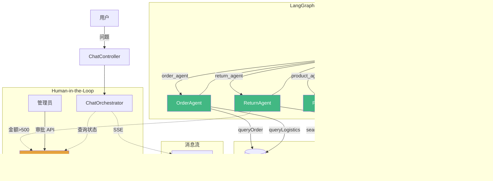

# 智能客服多Agent协同系统 🤖

> 基于 **LangGraph4j** + **LangChain4j** 的 Multi-Agent 客服系统
> 面试项目 —— 展示 AI Agent 编排与架构设计能力

---

## 项目简介

本项目实现了一个多 Agent 协同的电商智能客服系统。使用 **LangGraph4j** 的 `StateGraph` 编排多个 LLM Agent，通过 **Supervisor-Worker** 模式实现意图识别、任务分配、工具调用与 Human-in-the-Loop 审批流程。

### 架构图



### 技术栈

| 技术 | 版本 | 用途 |
|------|------|------|
| Java | 21 | 后端开发语言 |
| Spring Boot | 3.3.4 | 后端 Web 框架 |
| **LangGraph4j** | 1.8.9 | Agent 状态图编排（核心） |
| **LangChain4j** | 0.36.2 | LLM 调用 + Tool Calling |
| DeepSeek API | - | 底层大模型 |
| MySQL | 8.0 | 订单数据持久化 |
| MyBatis Plus | 3.5.7 | 数据库 ORM |
| Vue 3 | 3.4.31 | 前端框架 |
| Element Plus | 2.7.6 | 前端 UI 组件库 |

---

## 核心概念

### StateGraph（状态图）

用**图结构**而非链式结构编排多个 Agent：

| 概念 | 说明 |
|------|------|
| **Nodes（节点）** | Supervisor + 4 个 Worker + Finish |
| **Edges（边）** | 条件路由 + 循环回到 Supervisor |
| **State（状态）** | 通过 `CsAgentState` + `Channels` 管理，每个字段有独立的 Reducer |
| **Reducers（规约器）** | `appender` 追加消息、`base` 保留最新值、自定义累加器 |

### Supervisor-Worker 模式

| 角色 | 职责 | 数据来源 |
|------|------|---------|
| **Supervisor** | 意图识别 + 任务分配（LLM 驱动决策） | 纯 LLM 推理 |
| **order_agent** | 订单查询、物流查询 | **MySQL 数据库** |
| **product_agent** | 商品搜索、推荐 | 模拟数据 |
| **return_agent** | 退换货、退款计算 | 模拟数据 |
| **complaint_agent** | 投诉处理、升级人工 | 模拟数据 |

### Human-in-the-Loop（审批流程）

```
用户申请退款(800元) → 触发审批 → 管理员审批API → 用户查状态
                                           ↓
                                       ✅ 通过 / ❌ 拒绝
```

退款金额超过 500 元时自动创建审批请求，管理员通过 API 审批，用户可随时查询状态。

### 安全机制

- **轮次上限**：超过 6 轮强制结束，防止 Agent 死循环
- **JSON 兜底**：LLM 输出格式错误时自动降级为关键词匹配
- **异常捕获**：任何 Agent 异常都有 fallback 回复
- **会话隔离**：每个 sessionId 独立状态，互不干扰

---

## 快速启动

### 环境要求

- JDK 21+
- Maven 3.8+
- Node.js 18+
- MySQL 8.0+
- API Key（DeepSeek / OpenAI 兼容 API，可选）

### 启动步骤

#### 1️⃣ 初始化数据库

```sql
CREATE DATABASE IF NOT EXISTS cs_agent DEFAULT CHARSET utf8mb4;
-- 启动时会自动建表？手动执行 sql/init.sql
```

#### 2️⃣ 启动后端

```bash
cd /c/multi-agent-cs

# 编译
mvn clean install -DskipTests

# Mock 模式（无需 API Key，预设回复）
mvn spring-boot:run

# 真实模式（需要 API Key）
export AI_API_KEY=sk-your-key
# 修改 application.yml: mock-mode: false
mvn spring-boot:run
```

启动成功标志：
```
🧪 Supervisor 使用 Mock 模式
🧪 Worker 使用 Mock 模式
✅ StateGraph 编译完成！
Started CsCoreApplication in 1.157 seconds
```

#### 3️⃣ 启动前端

```bash
cd /c/multi-agent-cs/web
npm install --registry=https://registry.npmmirror.com
npm run dev
```

#### 4️⃣ 访问

| 服务 | 地址 |
|------|------|
| 后端 API | `http://localhost:8080` |
| 前端页面 | `http://localhost:88` |

### 配置

```yaml
# application.yml
ai:
  mock-mode: true               # true=Mock模式(无需API Key)  false=真实模型
  api-key: ${AI_API_KEY:sk-x}   # 真实模式需要配置
  model-name: deepseek-chat
  base-url: https://api.deepseek.com
  temperature: 0.3
```

---

## 项目结构

```
multi-agent-cs/
├── pom.xml                          # Maven 配置
├── src/main/java/com/cs/agent/
│   ├── CsCoreApplication.java       # Spring Boot 启动类
│   ├── config/
│   │   ├── AgentConfig.java         # LLM 配置（Mock/真实双模式）
│   │   ├── MockChatModel.java       # 模拟 LLM（预设回复）
│   │   ├── CorsConfig.java          # CORS 跨域配置
│   │   └── RedisConfig.java         # Redis 连接配置
│   ├── state/
│   │   └── CsAgentState.java        # ★ State 定义 + Schema + Channels
│   ├── node/
│   │   ├── SupervisorNode.java      # ★ LLM 驱动调度节点
│   │   ├── agent/                   # 4 个 Worker 节点
│   │   │   ├── OrderAgentNode.java
│   │   │   ├── ProductAgentNode.java
│   │   │   ├── ReturnAgentNode.java
│   │   │   └── ComplaintAgentNode.java
│   │   └── common/FinishNode.java
│   ├── tool/                        # Tool 层（Worker 调用的功能）
│   │   ├── OrderTools.java          #    查询 MySQL
│   │   ├── ProductTools.java
│   │   ├── ReturnTools.java
│   │   └── ComplaintTools.java
│   ├── entity/CsOrder.java          # 订单实体
│   ├── mapper/OrderMapper.java      # MyBatis Mapper
│   ├── service/
│   │   ├── OrderService.java        # 订单查询服务
│   │   ├── ApprovalStore.java       # ★ 审批存储（HITL 核心）
│   │   ├── SessionStore.java        # 会话存储接口
│   │   ├── MemorySessionStore.java  # 内存会话存储
│   │   └── RedisSessionStore.java   # ★ Redis 会话存储
│   ├── graph/
│   │   └── WorkflowBuilder.java     # ★ StateGraph 构建 + 编译
│   ├── orchestrator/
│   │   └── ChatOrchestrator.java    # 编排入口 + HITL 逻辑
│   └── controller/
│       └── ChatController.java      # REST API + 审批接口
├── web/                             # Vue 3 前端
│   └── src/views/chat/index.vue     # Element Plus 聊天页面
├── sql/init.sql                     # 数据库初始化脚本
└── README.md
```

---

## API 文档

### 聊天接口

| 方法 | 路径 | 说明 |
|------|------|------|
| POST | `/api/chat/send` | SSE 流式聊天 |
| POST | `/api/chat/send-sync` | 非流式聊天 |
| POST | `/api/chat/session` | 创建新会话 |
| GET | `/api/chat/session/{id}/history` | 获取历史消息 |

**POST /api/chat/send-sync** 请求体：
```json
{ "sessionId": "xxx", "message": "查一下我的订单" }
```

响应：
```json
{ "sessionId": "xxx", "reply": "您的订单 ORD20240630 查询结果：\n- 商品：iPhone 16 Pro 手机壳\n..." }
```

### 审批接口（Human-in-the-Loop）

| 方法 | 路径 | 说明 |
|------|------|------|
| GET | `/api/chat/approve/pending` | 获取所有待审批请求 |
| POST | `/api/chat/approve/{sessionId}` | 审批通过 |
| POST | `/api/chat/approve/{sessionId}/reject` | 拒绝审批 |
| GET | `/api/chat/approve/{sessionId}/status` | 查询审批状态 |

### 数据模型

```sql
-- 订单表
CREATE TABLE cs_order (
  id BIGINT AUTO_INCREMENT PRIMARY KEY,
  order_id VARCHAR(32) NOT NULL UNIQUE,
  user_id VARCHAR(32),
  product_name VARCHAR(100) NOT NULL,
  amount DECIMAL(10,2) NOT NULL,
  status TINYINT DEFAULT 0,   -- 0=待发货 1=已发货 2=已完成 3=已取消
  logistics_company VARCHAR(50),
  logistics_no VARCHAR(50),
  create_time DATETIME
);
```

---

## 测试数据

```bash
# 启动后测试四个路由
curl -s -X POST http://localhost:8080/api/chat/send-sync \
  -H "Content-Type: application/json" \
  -d '{"message":"查我的订单"}' | python3 -m json.tool

curl -s -X POST http://localhost:8080/api/chat/send-sync \
  -H "Content-Type: application/json" \
  -d '{"message":"推荐耳机"}' | python3 -m json.tool

curl -s -X POST http://localhost:8080/api/chat/send-sync \
  -H "Content-Type: application/json" \
  -d '{"message":"退货"}' | python3 -m json.tool

curl -s -X POST http://localhost:8080/api/chat/send-sync \
  -H "Content-Type: application/json" \
  -d '{"message":"投诉"}' | python3 -m json.tool
```

### HITL 审批测试

```bash
SESSION=$(curl -s -X POST http://localhost:8080/api/chat/session | grep -o '"sessionId":"[^"]*"' | cut -d'"' -f4)
curl -s -X POST http://localhost:8080/api/chat/send-sync -H "Content-Type: application/json" \
  -d "{\"sessionId\":\"$SESSION\",\"message\":\"refund\"}" > /dev/null
curl -s -X POST http://localhost:8080/api/chat/approve/$SESSION
curl -s -X POST http://localhost:8080/api/chat/send-sync -H "Content-Type: application/json" \
  -d "{\"sessionId\":\"$SESSION\",\"message\":\"approval status\"}"
```
